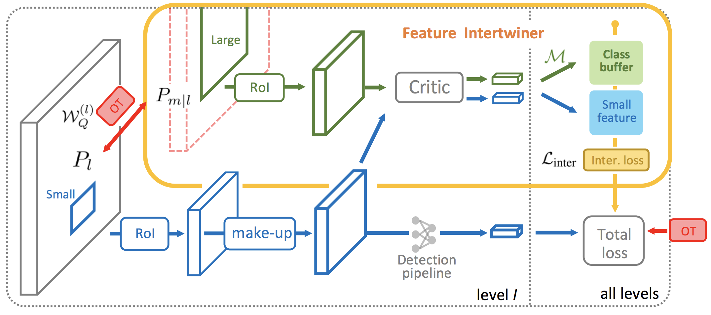

## Feature Intertwiner for Object Detection


A PyTorch implementation of our paper published at ICLR 2019.

By [Hongyang Li](), [Bo Dai](),
Shaoshuai Shi, 
Wanli Ouyang, and Xiaogang Wang.

[[arXiv]]()
[[Openreview]](https://openreview.net/forum?id=SyxZJn05YX) 
[[Poster]]()

[[Slides]](https://docs.google.com/presentation/d/12Syg5OXD6nGwtG_nwmoQ4kqX5GtJ-5pJ1OuVY53FqB0/edit?usp=sharing) (a 50-min talk presented at GTC 2019)


### Overview

Our assumption is that semantic features for one category should be the same as shown
in (a). Due to the inferior up-sampling design in RoI operation, shown in 
(b), the reliable set (green) could guide the feature learning of the less
reliable set (blue).


Here comes the proposed feature intertwiner:




- PyTorch `0.3` 
- Code/framework based on Mask-RCNN.
- Datasets: COCO and Pascal VOC (not in this repo)

### How to run

Follow instructions in [`INSTALL.md`](INSTALL.md) to 
set up datasets, symlinks, compilation, etc.

To train:
```bash
sh script/base_4gpu    105/meta_105_quick_1   0,2,5,7   # gpu ids
```
or execute `python main.py`. The configurations are stored 
in the `configs` folder.

To test:

Change the flag `--phase` in `main.py` to `inference`.  

### Adapting Feature Intertwiner to your own task

TODO.

### Citation
Please cite in the following manner if you find it useful in your research:
```
@inproceedings{li2019_internet,
  title = {{Feature Intertwiner for Object Detection}},
  author = {Hongyang Li and Bo Dai and Shaoshuai Shi and Wanli Ouyanbg and Xiaogang Wang},
  booktitle = {ICLR},
  year = {2019}
}
```


